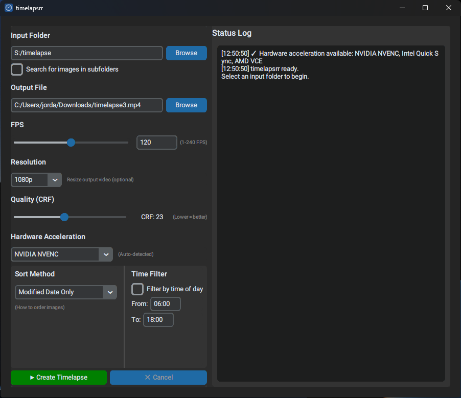

# timelapsrr

A modern GUI application for creating timelapse videos from image sequences. Built with Python and CustomTkinter, featuring hardware acceleration, corrupt file handling, and configurable image sorting.


## 🖼️ Screenshot



## 🚀 Quick Start

**Easiest way to run (requires Python 3.8+ and FFmpeg):**

- **macOS/Linux:** Double-click `launch.sh` or run `./launch.sh`
- **Windows:** Double-click `launch.bat`

The launcher will automatically:
1. Check for required dependencies (Python, FFmpeg, pip)
2. Install Python packages if needed
3. Launch the application

## ✨ Features

- 🖼️ **Configurable Image Sorting** - Multiple sorting methods including EXIF-based chronological ordering
- 🚀 **Hardware Acceleration** - Auto-detects NVIDIA NVENC, Intel Quick Sync, AMD VCE, and VideoToolbox (macOS)
- 🛡️ **Corrupt File Handling** - Gracefully skips damaged or invalid images
- ⏱️ **Time Filtering** - Filter images by time of day (great for excluding nighttime shots)
- 🎨 **Modern UI** - Clean, intuitive CustomTkinter GUI
- 📊 **Resolution Presets** - Choose from Actual, 4K, 1440p, 1080p, 720p, or 480p
- 🎚️ **Quality Control** - Adjustable CRF (Constant Rate Factor) for video quality
- ⚡ **Adjustable Speed** - Control timelapse speeds (1-240 FPS)
- 💾 **Settings Persistence** - Automatically saves your preferences
- 📝 **Detailed Logging** - Real-time status reporting
- 📂 **Recursive Search** - Optionally search for images in subfolders

## 📋 Requirements

- **Python 3.8 or higher**
- **FFmpeg** (must be installed on your system)
- Python packages (see installation below)

### Installing FFmpeg

**macOS:**
```bash
brew install ffmpeg
```

**Linux (Ubuntu/Debian):**
```bash
sudo apt update
sudo apt install ffmpeg
```

**Windows:**
Download from [ffmpeg.org](https://ffmpeg.org/download.html) and add to your system PATH.

## 🚀 Installation

1. **Clone or download this repository**

2. **Install FFmpeg** (see Requirements above)

3. **Install Python dependencies:**
```bash
pip install -r requirements.txt
```

## 💻 Usage

### Running the Application

```bash
python main.py
```

### How to Use

1. **Select Input Folder** - Click "Browse" to choose a folder containing your images
2. **Choose Output File** - Select where to save the timelapse (auto-suggested based on input folder)
3. **Adjust Settings:**
   - **FPS**: Higher values create faster timelapses (1-240 FPS)
   - **Resolution**: Resize output or keep original size
   - **Quality**: Lower CRF values produce better quality but larger files (0-51)
   - **Hardware Acceleration**: Use GPU encoding for faster processing (auto-detected)
   - **Sort Method**: Choose how images should be ordered
   - **Time Filter**: Optional filter by time of day
   - **Recursive Search**: Enable to search for images in subfolders
4. **Create Timelapse** - Click the green "▶ Create Timelapse" button
5. **Monitor Progress** - Watch the status log for real-time updates
6. **Cancel Anytime** - Click "✕ Cancel" to stop processing

### Supported Image Formats

- JPEG (.jpg, .jpeg)
- PNG (.png)
- BMP (.bmp)
- TIFF (.tiff, .tif)
- WebP (.webp)

## 🔧 Features in Detail

### Image Sorting Methods

The application offers multiple sorting strategies:

1. **EXIF → Modified → Filename** (Recommended)
   - Primary: EXIF DateTimeOriginal metadata
   - Fallback: File modification date
   - Final fallback: Filename

2. **EXIF → Created → Filename**
   - Primary: EXIF DateTimeOriginal
   - Fallback: File creation date
   - Final fallback: Filename

3. **Modified Date Only** - Sort by file modification date

4. **Created Date Only** - Sort by file creation date

5. **Filename Only** - Sort alphabetically by filename

### Hardware Acceleration

The application automatically detects available hardware encoders:

- **NVIDIA NVENC** - CUDA-based encoding on NVIDIA GPUs
- **Intel Quick Sync** - Intel integrated graphics acceleration
- **AMD VCE** - AMD Video Coding Engine
- **VideoToolbox** - macOS hardware acceleration
- **None** - Software encoding (libx264)

Hardware acceleration can significantly reduce encoding time, especially for high-resolution timelapses.

### Time Filtering

Filter images by the time of day they were captured:

- Useful for excluding nighttime shots or selecting specific daytime hours
- Automatically handles time ranges that span midnight (e.g., 22:00 to 06:00)
- Uses EXIF data when available, falls back to file modification time
- Images without time data are included by default

### Recursive Search

Enable the "Search for images in subfolders" checkbox to scan all subdirectories within your input folder:

- Useful for organizing images in nested directory structures
- All supported image formats in subfolders will be included
- Combines with all other features (sorting, time filtering, etc.)
- May increase processing time for large directory trees

### Resolution Presets

- **Actual** - Keep original image dimensions
- **4K** - 3840 × 2160
- **1440p** - 2560 × 1440
- **1080p** - 1920 × 1080
- **720p** - 1280 × 720
- **480p** - 854 × 480

### Quality (CRF)

The CRF (Constant Rate Factor) controls video quality:

- **Range**: 0-51 (lower = better quality, larger file)
- **18-28**: Good balance (default is 23)
- **0-16**: Near-lossless, very large files
- **29-51**: Lower quality, smaller files

## 📂 Project Structure

```
timelapsrr/
├── main.py              # Main application (CustomTkinter GUI)
├── requirements.txt      # Python dependencies
├── .gitignore           # Git ignore rules
├── launch.sh            # macOS/Linux launcher script
├── launch.bat           # Windows launcher script
└── README.md            # This file
```

## ⚙️ Settings File

Your preferences are automatically saved to:

- **macOS/Linux**: `~/.timelapsrr_settings.json`
- **Windows**: `C:\Users\YourUsername\.timelapsrr_settings.json`

This file stores:
- Last used folders
- FPS, resolution, and quality settings
- Hardware acceleration choice
- Sort method preference
- Time filter settings
- Recursive search preference

## 🎯 Use Cases

### Security Camera Footage
Create timelapses from periodic security camera snapshots, filtering to show only daytime hours.

### Photography Projects
Compile sequences of photos into smooth timelapse videos with customizable speed and quality.

### Nested Directory Structures
Use recursive search to create timelapses from images organized across multiple subdirectories.

## 🐛 Troubleshooting

### "FFmpeg not found" error
Make sure FFmpeg is installed and added to your system PATH:
```bash
ffmpeg -version
```

### No images processed
- Check that your input folder contains supported image formats
- Verify images have the correct file extensions (.jpg, .jpeg, .png, .bmp, .tiff, .tif, .webp)
- Check the status log for details on which files were skipped
- If using recursive search, ensure subfolders contain images

### Import errors
Reinstall Python dependencies:
```bash
pip install -r requirements.txt
```

### Hardware acceleration not working
- Check that your GPU drivers are up to date
- Verify FFmpeg supports your hardware encoder by running `ffmpeg -encoders`
- The status log will show detected hardware acceleration on startup

## 🔨 Dependencies

- **CustomTkinter** - Modern, themed Tkinter widgets
- **Pillow** - Image processing and EXIF data extraction
- **ffmpeg-python** - FFmpeg wrapper for video encoding

See `requirements.txt` for version requirements.

## 📝 Example Output

```
[14:30:45] timelapsrr ready.
[14:30:45] Select an input folder to begin.
[14:31:02] ✓ Hardware acceleration available: NVIDIA NVENC
[14:31:12] Selected input folder: /home/user/snapshots
[14:31:12] Found 288 image files. Validating...
[14:31:15]   Progress: 100/288 images (35%)
[14:31:18]   Progress: 200/288 images (69%)
[14:31:20]   ⚠ Skipping corrupt file: snapshot_2024-03-15_12-00-00.jpg
[14:31:22] ✓ 286 valid images
[14:31:22] ✗ 2 corrupt/invalid images skipped

[14:31:22] ==================================================
[14:31:22] Starting timelapse creation...
[14:31:22] ==================================================
[14:31:22] Total images to process: 286
[14:31:22] Settings: FPS=30, Resolution=1080p, Quality=23, HW Accel=NVIDIA NVENC
[14:31:22] 📊 Sorting by: EXIF → Modified → Filename

[14:31:23] Preparing image list...
[14:31:23] ✓ Image list created

[14:31:23] ==================================================
[14:31:23] Starting FFmpeg encoding...
[14:31:23] ==================================================
[14:31:23] Output: /home/user/snapshots_timelapse.mp4
[14:31:23] ⏳ Encoding in progress (please wait)...

[14:34:12] ==================================================
[14:34:12] ✓ TIMELAPSE CREATED SUCCESSFULLY!
[14:34:12] ==================================================
[14:34:12] 📁 Output file: /home/user/snapshots_timelapse.mp4
[14:34:12] 📊 File size: 45.23 MB
[14:34:12] 🖼️  Images used: 286
[14:34:12] ⏱️  Estimated duration: 9.5 seconds @ 30 FPS
[14:34:12] ⚡ Hardware acceleration: NVIDIA NVENC
[14:34:12] ==================================================

[14:34:12] ✅ All done! Ready for next timelapse.
```

## 📄 License

MIT License - Feel free to use and modify as needed.

## 🤝 Contributing

Suggestions, bug reports, and improvements are welcome! Feel free to open an issue or submit a pull request.

## 🙏 Acknowledgments

Built with:
- [CustomTkinter](https://github.com/TomSchimansky/CustomTkinter) - Modern, themed Tkinter widgets
- [Pillow](https://python-pillow.org/) - Python Imaging Library
- [FFmpeg](https://ffmpeg.org/) - Multimedia processing framework
- [ffmpeg-python](https://github.com/kkroening/ffmpeg-python) - FFmpeg Python wrapper